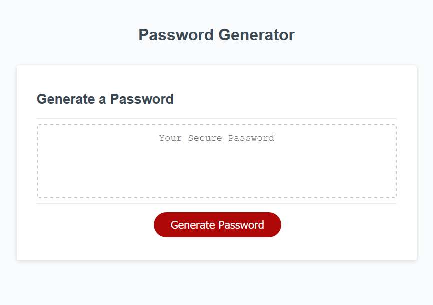

# Password Generator Challenge
Simple password generation tool using JavaScript to invoke web browser dialogue boxes for user input.

## Contains
* Prompts for the desired password length and verifies that the entered number is an integer within the range of 8 - 128
* Prompts for including lowercase, uppercase, numeric, and special characters
* Validates that at least one of the above criteria was selected
* Generates a password based on the above criteria OR
* Allows the user to cancel the password creation process if no criteria were selected

## Built With
* HTML
* CSS
* JavaScript

## Website
https://csouthwick.github.io/password-generator-challenge/

## Screenshot

## Disclaimer
This is a code exercise and not meant to take the place of other password generation tools. No guarantees are made on the security of any generated passwords.
